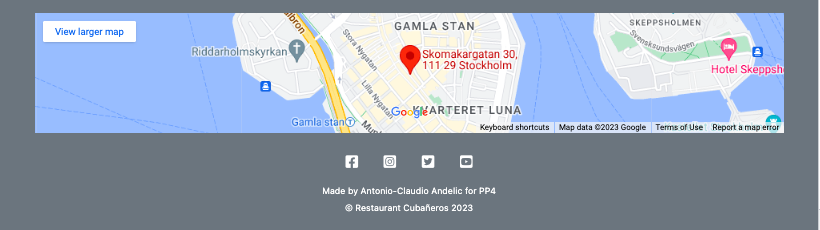

# Restaurant Cubaneros 


My project is a restaurant website which represents a traditional rustic cuban cuisine. The websites main features, as 'about', 'menu', contacts' displays the 'read' part of CRUD to the user and gives the important information about the websites goal to the user, while the admin can change and update the same information from the backend. The crucial part of the project is the 'book here!'(or the booking form) and 'my bookings' which gives the user/admin the possibility for 'create', 'update' and 'delete' in CRUD, so that a reservation/booking can be created, edited or removed. As admin these bookings can be approved or rejected and the status of this action reflects in the frontend presentation, which gives the user the possibility to follow up the status themselves.

<hr>

[Live Website] (https://pp4.herokuapp.com/)

Github Repository (https://github.com/eleanorbucke21/PP4)

<br>

## CONTENTS

* [User Experience](#user-experience-ux)
  * [Agile](#agile)
  * [User Stories](#user-stories)

* [Design](#design)
  * [Colour Scheme](#colour-scheme)
  * [Typography](#typography)
  * [Imagery](#imagery)
  * [Wireframes](#wireframes)

* [Features](#features)
  * [General Features on Each Page](#general-features-on-each-page)
  * [Future Implementations](#future-implementations)
  * [Accessibility](#accessibility)

* [Technologies Used](#technologies-used)
  * [Languages Used](#languages-used)
  * [Frameworks, Libraries & Programs Used](#frameworks-libraries--programs-used)

* [Deployment & Local Development](#deployment--local-development)
  * [Deployment](#deployment)
  * [Local Development](#local-development)
    * [How to Fork](#how-to-fork)
    * [How to Clone](#how-to-clone)

* [Testing](#testing)

* [Credits](#credits)
  * [Code Used](#code-used)
  * [Content](#content)
  * [Media](#media)
  * [Acknowledgments](#acknowledgments)

<hr>


## User Experience (UX)

Visitors looking for a safe place to share their stories and a good laugh should find this website interesting and charming. We are a charitable organization with a goal of sharing information and helping people to get the answers they are looking for or in case  they need even further help pointing them towards the right direction.  

The front page provides the visitor with a short introduction and the events contact and info. Besides that they can visit webites gallery full with lgbtq+ related sharing and caring photos. 

In case you wanna have some fun and share your story proceed to our sign up page. 

Everyone can enjoy their visit to our website because we have adjusted it and designed for all different screen sizes.

### Agile

The project is build using the agile methodology. Link to the project board: [here](https://github.com/users/Balkaneros91/projects/13/views/1)

### User Stories

User stories


## Design

### Colour Scheme

I wanted to keep it simple and light. The color palette matches the cover image and is well suited color scheme for the full website.

[Coolors.co](https://coolors.co/) was the website I've used to fetch the colour palette presented.


### Typography

After I have applied the bootstrap CND I really liked the font style which came along with it and so I decided to just stick to it.

## <strong>Wireframes</strong>

[Balsamiq](https://balsamiq.com/wireframes) used for wireframe design.

### Restaurant's Home Page

<details>
<summary>Click here!</summary>

#### Mobile


#### Desktop


#### Desktop


</details>

### About Page

<details>
<summary>Click here!</summary>

#### Mobile


#### Desktop


</details>

### Menu Page

<details>
<summary>Click here!</summary>

#### Mobile


#### Desktop


</details>

### Meal details page

<details>
<summary>Click here!</summary>

#### Mobile


#### Desktop


</details>

### Booking form

<details>
<summary>Click here!</summary>

#### Mobile


#### Desktop


</details>

### Booking confirmation

<details>
<summary>Click here!</summary>

#### Mobile


#### Desktop


</details>

### Contacts page

<details>
<summary>Click here!</summary>

#### Mobile


#### Desktop


</details>

### Bookings list

<details>
<summary>Click here!</summary>

#### Mobile


#### Desktop


</details>

### Edit bookings

<details>
<summary>Click here!</summary>

#### Mobile


#### Desktop


</details>

### Delete bookings

<details>
<summary>Click here!</summary>

#### Mobile


#### Desktop


</details>

### Sign in Page

<details>
<summary>Click here!</summary>

#### Mobile


#### Desktop


</details>

### Sign out Page

<details>
<summary>Click here!</summary>

#### Mobile


#### Desktop


</details>

### Sign up Page

<details>
<summary>Click here!</summary>

#### Mobile


#### Desktop


</details>

### Error Pages

<details>
<summary>Click here!</summary>

#### Mobile


#### Desktop


</details>

<hr>

## Features

My website is built of 3 pages, index.html as a home page, gallery.html as the gallery page, and signup.html as the sign up page. 

### Final look of the Home page


### Final look of the About page


### Final look of the Menu page


### Final look of the Meal detail page


### Final look of the Booking form page


### Final look of the Booking confirmation page


### Final look of the Contacts page


### Final look of the Bookings list page


### Final look of the Edit booking page


### Final look of the Delete booking page


### Final look of the Sign in page


### Final look of the Sign out page


### Final look of the Sign up page


### Final look of the Error pages


### Footer


### Success messages


### General features on each page

The navigation menu and footer is continiously the same throughout all the pages of my website.

### Future Implementations

This page has a potential to grow bigger. There is a playground for a lots of future implementations.

### Accessibility

I have  have tried my best to be mindful of accessibility, and the steps I've taken for this are the following:

- Semantic HTML
- All the links has their aria-labels
- The color choices and the backgroud images doesn't disturb the content
- All images under the gallery site are informativly described 


## Technologies Used

### Languages Used

<ul>
<li>Python</li>
<li>HTML/CSS</li>
<li>JavaScript</li>
</ul>

### Frameworks, Libraries & Programs Used

<ul>
<li>Django</li>
<li>Bootstrap</li>
<li>Cloudinary-storage</li>
<li>PostgreSQL</li>
<li>Github</li>
<li>Gitpod</li>
<li>Balsamic</li>
</ul>


## Deployment & Local Development

### Deployment

[View live site on Github Pages](https://balkaneros91.github.io/whatsss-the-tea/)

### Local Development

If you wish to clone my project, please see the following steps below:

1. Navigate to Github: https://balkaneros91.github.io/whatsss-the-tea/
2. Select the 'Clone' button 
3. Copy the url or download as ZIP file
4. Use git clone + the url in your terminal, or unpack the ZIP containing the project

"""
"""
## Deployment

The live deployed application can be found deployed on [Heroku](https://tribe.herokuapp.com).


### ElephantSQL Database

This project uses [ElephantSQL](https://www.elephantsql.com) for the PostgreSQL Database.

To obtain your own Postgres Database, sign-up with your GitHub account, then follow these steps:
- Click **Create New Instance** to start a new database.
- Provide a name (this is commonly the name of the project: tribe).
- Select the **Tiny Turtle (Free)** plan.
- You can leave the **Tags** blank.
- Select the **Region** and **Data Center** closest to you.
- Once created, click on the new database name, where you can view the database URL and Password.


### Cloudinary API

This project uses the [Cloudinary API](https://cloudinary.com) to store media assets online, due to the fact that Heroku doesn't persist this type of data.

To obtain your own Cloudinary API key, create an account and log in.
- For *Primary interest*, you can choose *Programmable Media for image and video API*.
- Optional: *edit your assigned cloud name to something more memorable*.
- On your Cloudinary Dashboard, you can copy your **API Environment Variable**.
- Be sure to remove the `CLOUDINARY_URL=` as part of the API **value**; this is the **key**.


### Heroku Deployment

This project uses [Heroku](https://www.heroku.com), a platform as a service (PaaS) that enables developers to build, run, and operate applications entirely in the cloud.

Deployment steps are as follows, after account setup:

- Select **New** in the top-right corner of your Heroku Dashboard, and select **Create new app** from the dropdown menu.
- Your app name must be unique, and then choose a region closest to you (EU or USA), and finally, select **Create App**.
- From the new app **Settings**, click **Reveal Config Vars**, and set your environment variables.

| Key | Value |
| --- | --- |
| `CLOUDINARY_URL` | insert your own Cloudinary API key here |
| `DATABASE_URL` | insert your own ElephantSQL database URL here |
| `DISABLE_COLLECTSTATIC` | 1 (*this is temporary, and can be removed for the final deployment*) |
| `SECRET_KEY` | this can be any random secret key |

Heroku needs two additional files in order to deploy properly.
- requirements.txt
- Procfile

You can install this project's **requirements** (where applicable) using:
- `pip3 install -r requirements.txt`

If you have your own packages that have been installed, then the requirements file needs updated using:
- `pip3 freeze --local > requirements.txt`

The **Procfile** can be created with the following command:
- `echo web: gunicorn app_name.wsgi > Procfile`
- *replace **app_name** with the name of your primary Django app name; the folder where settings.py is located*

For Heroku deployment, follow these steps to connect your own GitHub repository to the newly created app:

Either:
- Select **Automatic Deployment** from the Heroku app.

Or:
- In the Terminal/CLI, connect to Heroku using this command: `heroku login -i`
- Set the remote for Heroku: `heroku git:remote -a app_name` (replace *app_name* with your app name)
- After performing the standard Git `add`, `commit`, and `push` to GitHub, you can now type:
	- `git push heroku main`

The project should now be connected and deployed to Heroku!

### Local Deployment

This project can be cloned or forked in order to make a local copy on your own system.

For either method, you will need to install any applicable packages found within the *requirements.txt* file.
- `pip3 install -r requirements.txt`.

You will need to create a new file called `env.py` at the root-level,
and include the same environment variables listed above from the Heroku deployment steps.

Sample `env.py` file:

```python
import os

os.environ.setdefault("CLOUDINARY_URL", "insert your own Cloudinary API key here")
os.environ.setdefault("DATABASE_URL", "insert your own ElephantSQL database URL here")
os.environ.setdefault("SECRET_KEY", "this can be any random secret key")

# local environment only (do not include these in production/deployment!)
os.environ.setdefault("DEBUG", "True")
```

Once the project is cloned or forked, in order to run it locally, you'll need to follow these steps:
- Start the Django app: `python3 manage.py runserver`
- Stop the app once it's loaded: `CTRL+C` or `⌘+C` (Mac)
- Make any necessary migrations: `python3 manage.py makemigrations`
- Migrate the data to the database: `python3 manage.py migrate`
- Create a superuser: `python3 manage.py createsuperuser`
- Load fixtures (if applicable): `python3 manage.py loaddata file-name.json` (repeat for each file)
- Everything should be ready now, so run the Django app again: `python3 manage.py runserver`

### Cloning

You can clone the repository by following these steps:

1. Go to the [GitHub repository](https://github.com/adamgilroy22/tribe) 
2. Locate the Code button above the list of files and click it 
3. Select if you prefer to clone using HTTPS, SSH, or GitHub CLI and click the copy button to copy the URL to your clipboard
4. Open Git Bash or Terminal
5. Change the current working directory to the one where you want the cloned directory
6. In your IDE Terminal, type the following command to clone my repository:
	- `git clone https://github.com/adamgilroy22/tribe.git`
7. Press Enter to create your local clone.

Alternatively, if using Gitpod, you can click below to create your own workspace using this repository.

[](https://gitpod.io/#https://github.com/adamgilroy22/tribe)

Please note that in order to directly open the project in Gitpod, you need to have the browser extension installed.
A tutorial on how to do that can be found [here](https://www.gitpod.io/docs/configure/user-settings/browser-extension).

### Forking

By forking the GitHub Repository, we make a copy of the original repository on our GitHub account to view and/or make changes without affecting the original owner's repository.
You can fork this repository by using the following steps:

1. Log in to GitHub and locate the [GitHub Repository](https://github.com/adamgilroy22/tribe)
2. At the top of the Repository (not top of page) just above the "Settings" Button on the menu, locate the "Fork" Button.
3. Once clicked, you should now have a copy of the original repository in your own GitHub account!
"""
"""


## Testing

All the links in the navigation bar and in the footer has been tested and works. The logo link always brings us back to the main page, while the About and Contact links are only index.html local links so avoid scrolling up and down on the page. The rest as Gallery and Sign Up links opens a new tab in the browser for easier navigation between pages. And the deployed website has been tested in Chrome, Safari, Internet Explorer (Opera) and Firefox. Media queries looks good and been tested throughout different screen sizes.

I have used Responsinator.com for testing:
- [Responsinator](http://www.responsinator.com/)


### Lighthouse

For mobile: 

For desktop: 


### W3C HTML Validator


### W3C CSS Validator


### Known bugs

No known bugs detected

### Solved Bugs

I came accross many issues and bugs while creating this project. Understanding of flexbox didn't really workout. During the 2nd mentor meeting Antonio Rodriguez introduced me and explained the grid view which saved my first project. I needed a lot of playing around, moving code back and forward until it really settled in my head.

He mentioned that it would be good to add a comment that due to changes and extra time I needed to put all the code together I had to create a new repository and that is why all the commits came in within few hours because I had to migrate everything from one repo to a new one.

Some of the bugs I came accross and fixed: 

+ Background images
  + Description: Diffrent size throughout differet screen sizes
  + Expected behaviour: Full image with no missing sides all the time covering its own content
  + Actual behaviour: The image was too small or too big or missing a part of it
  + Fix: Add code background-size: 100%; or background-size: cover; plus adjusting the media queries

  + Quotation
  + Description: Wrong positioning on the logo image and throughtout different screens changing its place
  + Expected behaviour: To not disturb nor overflow the logo image
  + Actual behaviour: Running over the logo image and due to color choice text can't be read
  + Fix: Adjusting the media queries to different screen sizes

+ Footer
  + Description: Footer wrongly positioned on the small screen
  + Expected behaviour: Footer at all times should be horizontal
  + Actual behaviour: Footer vertical positioning on small screen
  + Fix: Adding the correct class attribute col-s-4.

"""
"""
## Testing
<hr>
<ul>Manual Testing:
<li>Booking data model tested: all of its CRUD functionality for the admin and users</li>
<li>Tested confirm bookings by admin.</li>
<li>Menu data model tested: create and read functionality for admin, and only view for users</li>
<li>Announcements data model: tested create and read functionality for the admin and only view for users</li>
<li>Sign-up/ Sign-in forms and links all tested to confirm working as intended</li>
<li>Tested Booking page links and all its functionality</li>
<li>Tested User Authorisations to ensure role-based functions such as Booking page access, edit or deleting bookings</li>
</ul>

## <strong>Testing</strong>
- [W3C Markup Validation Serice](https://validator.w3.org/) was used to test for error codes in the HTML.
- [W3C CSS Validator](https://jigsaw.w3.org/css-validator/)  was used to test for error codes in the CSS.
- [CI Python Linter](https://pep8ci.herokuapp.com/) was used to detect errors and potential problems in Python code.
- [Chrome DevTools](https://developer.chrome.com/docs/devtools/)
    was used during the development process to test, debug, explore and modify HTML elements, and to test responsiveness in different screen sizes.
- [Lighthouse](https://developer.chrome.com/docs/lighthouse/overview/) was used for improving the quality of web page. It has audits for performance, accessibility, progressive web apps, SEO, and more.


### <u>Website validation testing</u>

### <u>JShint</u>
I did not perform any validation on javascript as all the javascript was imported in from [clean blog](https://github.com/StartBootstrap/startbootstrap-clean-blog).

### <u>W3C Markup Validation Serice</u>
No errors were recieved on the pages except for the post detail page which recieved one error.
|Error |Error explanation| Code |
| ------------- | ------------- |------------- |
|  |  ||

### <u>W3C CSS Validator</u>
No errors were recieved on the pages. <br>


### <u>Code Institute Python Linter</u>

- bawarchikhana/settings.py <br>


- bawarchikhana/urls.py <br>


- blog/admin.py , blog/forms.py, blog/models.py, blog/views.py.<br>


- blog/urls.py. <br>


### <u>Lighthouse</u>
|Page | Mobile  | Computer|
| ------------- | ------------- |------------- |
| Index | | 
| Register || 
|


### <u>Manual Testing</u>
Browser Compatibility:

Browser | Outcome | Pass/Fail 
 --- | --- | ---
Google Chrome | No appearance, responsiveness nor functionality issues.| Pass
Safari | No appearance, responsiveness nor functionality issues. | Pass
Microsoft Edge | No appearance, responsiveness nor functionality issues. | Pass
Firefox | No appearance, responsiveness nor functionality issues. | Pass


## <strong>Bugs</strong>

### <u>Unsolved Bugs</u>
- The navigation bar continues to move around the screen even with it being set to absolute. I have been unable to solve the issue. 

### <u>Solved Bugs</u>
- When adding success messages I found that there was a bug on the DeletePost view.
- With this view I had to add different code than the others to correct it.
- I corrected this by adding this code from [stack overflow](https://stackoverflow.com/questions/48777015/djangos-successmessagemixin-not-working-with-deleteview)


### Validator Testing
<ul>
<li>All Python code ran through PEOP8 checker succesfully without any problem.</li>

<li>All CSS files ran through CSS jigsaw validator with no errors</li>

[CSS JIGSAW](https://jigsaw.w3.org/css-validator/) passed with no erros.


<li>All HTML files ran through W3C validator with no errors</li>

[HTML W3C validator](https://validator.w3.org/)
</ul>

<hr>
"""
"""

## Credits

Code Institue projects: Coders Coffehouse and Love Running has been the inspiration for my websites design.
The help I've used with syntax and formatting, please see links and description below.

### Code Used

- [w3schools](https://www.w3schools.com/)
- [How to position text above an image](https://www.w3schools.com/HOWTO/howto_css_image_text.asp)
- [CSS Media Queries](https://www.w3schools.com/css/css3_mediaqueries.asp)
- [Grid-View](https://www.w3schools.com/css/css_rwd_grid.asp)
- [emmet.io](https://docs.emmet.io/cheat-sheet/)


### Content

The code is mostly created by me and I was inspired by the traditional cuban cuisine.

###  Media

- [Favicon](https://favicon.io/emoji-favicons/curry-rice/) The curry and Rice emoji. <br>


All the other images are downloaded from online only for purposes of this project.
  
###  Acknowledgments

And last but not least a big thanks to my mentor Antonio Rodriguez and to the CI tutor team who help a lot during the process.

This project tested me to my limits at times and I could not have seen it to completion without the support of the following people.
- 
- 

Recived help from Daniel_c_5p on slack in :
<ul>
<li>restrict booking views to the user that owns the booking</li>
<li>Help with menu view function to view menu items in 4 seperate categories</li>
</ul>

Code institute tutor support helped me get back on track on several occasions when I had errors or any problems throughout the project.


## Responsiveness
[Am I Responsive?](http://ami.responsivedesign.is/#) used for check responsiveness of the site pages across different screen sizes.
