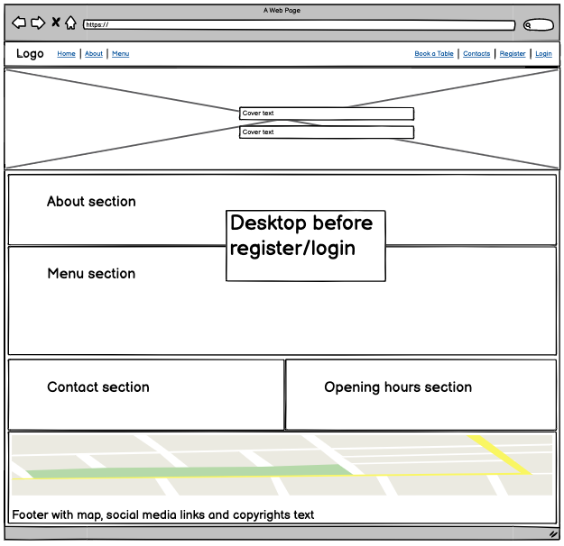
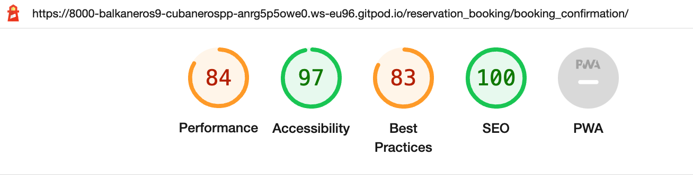
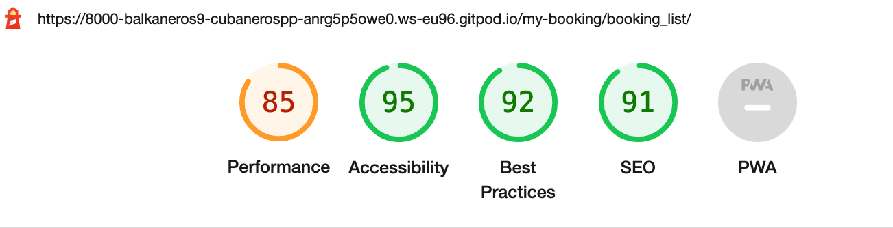
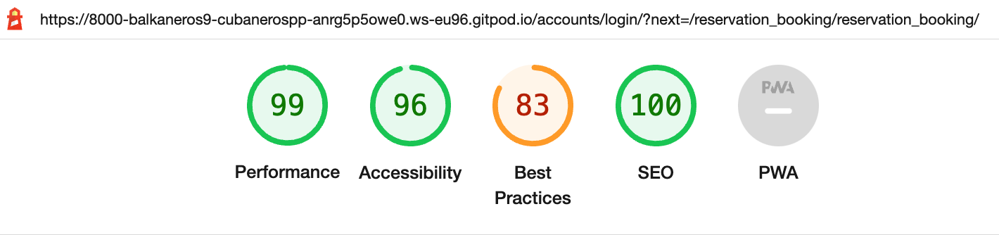

# Restaurant Cubaneros 


My project is a restaurant website which represents a traditional rustic cuban cuisine. The websites main features, as 'about', 'menu', contacts' displays the 'read' part of CRUD to the user and gives the important information about the websites goal to the user, while the admin can change and update the same information from the backend. The crucial part of the project is the 'book here!'(or the booking form) and 'my bookings' which gives the user/admin the possibility for 'create', 'update' and 'delete' in CRUD, so that a reservation/booking can be created, edited or removed. As admin these bookings can be approved or rejected and the status of this action reflects in the frontend presentation, which gives the user the possibility to follow up the status themselves.

<hr>

The live deployed application can be found deployed on [Heroku]().

The link to my Github repository's [Github Repo](https://github.com/Balkaneros91/Cubaneros-PP4).

<hr>

## CONTENTS

* [User Experience](#user-experience-ux)
  * [Agile](#agile)
  * [User Stories](#user-stories)
  * [Project stages](#project-stages)

* [Design](#design)
  * [Colour Scheme](#colour-scheme)
  * [Typography](#typography)
  * [Wireframes](#wireframes)

* [Features](#features)
  * [General Features on Each Page](#general-features-on-each-page)
  * [Future Implementations](#future-implementations)

* [Technologies Used](#technologies-used)
  * [Languages Used](#languages-used)
  * [Frameworks, Libraries & Programs Used](#frameworks-libraries--programs-used)

* [Deployment & Local Development](#deployment--local-development)
  * [Deployment](#deployment)
  * [ElephantSQL databse](#elephantsql-database)
  * [Cloudinary API](#cloudinary-api)
  * [Heroku deployment](#heroku-deployment)
  * [Local deployment](#local-deployment)
    * [Cloning](#cloning)
    * [Forking](#forking)


* [Testing](#testing)
  * [Responsiveness](#responsiveness)
  * [Manual testing](#manual-testing)
  * [Browser Compatibility](#browser-compatibility)
  * [Lighthouse](#lighthouse)
  * [W3C HTML Validator](#w3c-html-validator)
  * [JIGSAW W3C CSS Validator](#jigsaw-w3c-css-validator)
  * [JShint](#jshint)
  * [Code Institute Python Linter](#code-institute-python-linter)
  * [Chrome DevTools](#chrome-devTools)
  * [Known bugs](#known-bugs)
  * [Solved bugs](#solved-bugs)

* [Credits](#credits)
  * [Code Used](#code-used)
  * [Content](#content)
  * [Media](#media)
  * [Acknowledgments](#acknowledgments)

<hr>


## User Experience (UX)

Users visiting the restaurants website are looking for a new place to explore. We are offering a real rustic traditional experiance to excape the luxuary fancy vibe but still a place to fine dine. 

The front page provides the user with all the necessary content so they could decide if that is the place they want to explore. If not authenticated they can access almost all the content of the page until it gets to the reservation part of it, for which authentication is required.

Everyone can enjoy their visit to our website because we have adjusted it and designed for all different screen sizes.

### Agile

The project is build using the agile methodology. Link to the project board: [here](https://github.com/users/Balkaneros91/projects/13/views/1)

### User Stories

I have created user stories based on the agile methodology and I have created them using the Githubs kanban. In the upcoming images the projects build-up process can be followed up throughout different stages.

### Project stages

### Stage 1

<details>
<summary>Click here to see the progress in KanBan:</summary>


</details>

### Stage 2

<details>
<summary>Click here to see the progress in KanBan:</summary>


</details>

### Stage 3

<details>
<summary>Click here to see the progress in KanBan:</summary>


</details>

### Stage 4

<details>
<summary>Click here to see the progress in KanBan:</summary>


</details>

### Stage 5

<details>
<summary>Click here to see the progress in KanBan:</summary>


</details>

### Last stage - done

<details>
<summary>Click here to see the progress in KanBan:</summary>


</details>

<hr>

## Design

### Colour Scheme

I wanted to keep it simple and light. The color palette matches the cover image and is well suited color scheme for the full website.

[Coolors.co](https://coolors.co/) was the website I've used to fetch the colour palette presented.


### Typography

After I have applied the bootstrap CND I really liked the font style which came along with it and so I decided to just stick to it.

<hr>

## Wireframes

[Balsamiq](https://balsamiq.com/wireframes) is used for wireframe design.

### Restaurant's Home Page

<details>
<summary>Click here!</summary>

#### Mobile


#### Desktop


#### Desktop


</details>

### About Page

<details>
<summary>Click here!</summary>

#### Mobile


#### Desktop


</details>

### Menu Page

<details>
<summary>Click here!</summary>

#### Mobile


#### Desktop


</details>

### Meal details page

<details>
<summary>Click here!</summary>

#### Mobile


#### Desktop


</details>

### Booking form

<details>
<summary>Click here!</summary>

#### Mobile


#### Desktop


</details>

### Booking confirmation

<details>
<summary>Click here!</summary>

#### Mobile


#### Desktop


</details>

### Contacts page

<details>
<summary>Click here!</summary>

#### Mobile


#### Desktop


</details>

### Bookings list

<details>
<summary>Click here!</summary>

#### Mobile


#### Desktop


</details>

### Edit bookings

<details>
<summary>Click here!</summary>

#### Mobile


#### Desktop


</details>

### Delete bookings

<details>
<summary>Click here!</summary>

#### Mobile


#### Desktop


</details>

### Sign in Page

<details>
<summary>Click here!</summary>

#### Mobile


#### Desktop


</details>

### Sign out Page

<details>
<summary>Click here!</summary>

#### Mobile


#### Desktop


</details>

### Sign up Page

<details>
<summary>Click here!</summary>

#### Mobile


#### Desktop


</details>

### Error Pages

<details>
<summary>Click here!</summary>

#### Mobile


#### Desktop


</details>

<hr>

## Features

My website includes the base.html and the rest of the pages are build using templating. 

### Final look of the Home page

<details>
<summary>Click here!</summary>


</details>

### Final look of the About page

<details>
<summary>Click here!</summary>


</details>

### Final look of the Menu page

<details>
<summary>Click here!</summary>


</details>

### Final look of the Meal detail page

<details>
<summary>Click here!</summary>


</details>

### Final look of the Booking form page

<details>
<summary>Click here!</summary>


</details>

### Final look of the Booking confirmation page

<details>
<summary>Click here!</summary>


</details>

### Final look of the Contacts page

<details>
<summary>Click here!</summary>


</details>

### Final look of the Bookings list page

<details>
<summary>Click here!</summary>


</details>

### Final look of the Edit booking page

<details>
<summary>Click here!</summary>


</details>

### Final look of the Delete booking page

<details>
<summary>Click here!</summary>


</details>

### Final look of the Sign in page

<details>
<summary>Click here!</summary>


</details>

### Final look of the Sign out page

<details>
<summary>Click here!</summary>


</details>

### Final look of the Sign up page

<details>
<summary>Click here!</summary>


</details>

### Final look of the Error pages

<details>
<summary>Click here!</summary>


</details>

### Footer

<details>
<summary>Click here!</summary>


</details>

### Success messages

<details>
<summary>Click here!</summary>


</details>

### General features on each page

The navigation menu and footer is continiously the same throughout all the pages of my website.

### Future Implementations

This page has a potential to grow bigger. There is open space for many possible future implementations, like email automation, adding tables and available time slots to the booking form and so on.

<hr>

## Technologies Used

### Languages Used

<ul>
<li>Python</li>
<li>HTML/CSS</li>
<li>JavaScript</li>
</ul>

### Frameworks, Libraries & Programs Used

<ul>
<li>Django</li>
<li>Bootstrap</li>
<li>Cloudinary-storage</li>
<li>PostgreSQL</li>
<li>Github</li>
<li>Gitpod</li>
<li>Balsamic</li>
</ul>

<hr>

## Deployment & Local Development

### Deployment

The live deployed application can be found deployed on [Heroku]().


### ElephantSQL Database

This project uses [ElephantSQL](https://www.elephantsql.com) for the PostgreSQL Database.

To obtain your own Postgres Database, sign-up with your GitHub account, then follow these steps:
- Click **Create New Instance** to start a new database.
- Provide a name (this is commonly the name of the project: tribe).
- Select the **Tiny Turtle (Free)** plan.
- You can leave the **Tags** blank.
- Select the **Region** and **Data Center** closest to you.
- Once created, click on the new database name, where you can view the database URL and Password.


### Cloudinary API

This project uses the [Cloudinary API](https://cloudinary.com) to store media assets online, due to the fact that Heroku doesn't persist this type of data.

To obtain your own Cloudinary API key, create an account and log in.
- For *Primary interest*, you can choose *Programmable Media for image and video API*.
- Optional: *edit your assigned cloud name to something more memorable*.
- On your Cloudinary Dashboard, you can copy your **API Environment Variable**.
- Be sure to remove the `CLOUDINARY_URL=` as part of the API **value**; this is the **key**.


### Heroku Deployment

This project uses [Heroku](https://www.heroku.com), a platform as a service (PaaS) that enables developers to build, run, and operate applications entirely in the cloud.

Deployment steps are as follows, after account setup:

- Select **New** in the top-right corner of your Heroku Dashboard, and select **Create new app** from the dropdown menu.
- Your app name must be unique, and then choose a region closest to you (EU or USA), and finally, select **Create App**.
- From the new app **Settings**, click **Reveal Config Vars**, and set your environment variables.

| Key | Value |
| --- | --- |
| `CLOUDINARY_URL` | insert your own Cloudinary API key here |
| `DATABASE_URL` | insert your own ElephantSQL database URL here |
| `DISABLE_COLLECTSTATIC` | 1 (*this is temporary, and can be removed for the final deployment*) |
| `SECRET_KEY` | this can be any random secret key |

Heroku needs two additional files in order to deploy properly.
- requirements.txt
- Procfile

You can install this project's **requirements** (where applicable) using:
- `pip3 install -r requirements.txt`

If you have your own packages that have been installed, then the requirements file needs updated using:
- `pip3 freeze --local > requirements.txt`

The **Procfile** can be created with the following command:
- `echo web: gunicorn app_name.wsgi > Procfile`
- *replace **app_name** with the name of your primary Django app name; the folder where settings.py is located*

For Heroku deployment, follow these steps to connect your own GitHub repository to the newly created app:

Either:
- Select **Automatic Deployment** from the Heroku app.

Or:
- In the Terminal/CLI, connect to Heroku using this command: `heroku login -i`
- Set the remote for Heroku: `heroku git:remote -a app_name` (replace *app_name* with your app name)
- After performing the standard Git `add`, `commit`, and `push` to GitHub, you can now type:
	- `git push heroku main`

The project should now be connected and deployed to Heroku!

### Local Deployment

This project can be cloned or forked in order to make a local copy on your own system.

For either method, you will need to install any applicable packages found within the *requirements.txt* file.
- `pip3 install -r requirements.txt`.

You will need to create a new file called `env.py` at the root-level,
and include the same environment variables listed above from the Heroku deployment steps.

Sample `env.py` file:

```python
import os

os.environ.setdefault("CLOUDINARY_URL", "insert your own Cloudinary API key here")
os.environ.setdefault("DATABASE_URL", "insert your own ElephantSQL database URL here")
os.environ.setdefault("SECRET_KEY", "this can be any random secret key")

# local environment only (do not include these in production/deployment!)
os.environ.setdefault("DEBUG", "True")
```

Once the project is cloned or forked, in order to run it locally, you'll need to follow these steps:
- Start the Django app: `python3 manage.py runserver`
- Stop the app once it's loaded: `CTRL+C` or `⌘+C` (Mac)
- Make any necessary migrations: `python3 manage.py makemigrations`
- Migrate the data to the database: `python3 manage.py migrate`
- Create a superuser: `python3 manage.py createsuperuser`
- Load fixtures (if applicable): `python3 manage.py loaddata file-name.json` (repeat for each file)
- Everything should be ready now, so run the Django app again: `python3 manage.py runserver`

### Cloning

You can clone the repository by following these steps:

1. Go to the [GitHub repository](https://github.com/Balkaneros91/Cubaneros-PP4) 
2. Locate the Code button above the list of files and click it 
3. Select if you prefer to clone using HTTPS, SSH, or GitHub CLI and click the copy button to copy the URL to your clipboard
4. Open Git Bash or Terminal
5. Change the current working directory to the one where you want the cloned directory
6. In your IDE Terminal, type the following command to clone my repository:
	- `git clone https://github.com/Balkaneros91/Cubaneros-PP4.git`
7. Press Enter to create your local clone.

### Forking

By forking the GitHub Repository, we make a copy of the original repository on our GitHub account to view and/or make changes without affecting the original owner's repository.
You can fork this repository by using the following steps:

1. Log in to GitHub and locate the [GitHub Repository](https://github.com/Balkaneros91/Cubaneros-PP4)
2. At the top of the Repository (not top of page) just above the "Settings" Button on the menu, locate the "Fork" Button.
3. Once clicked, you should now have a copy of the original repository in your own GitHub account!

<hr>

## Testing

All the links in the navigation bar and in the footer has been tested and works. The logo link always brings us back to the main page. Menu located on the 'home' page has different tabs for all the categories and when clicked, the menu items related to that category will be displayed to the user. Menu located on the 'menu' page has the categories listed in the top of the menu and when clicked the link will take you to the chosen category just further down the page.

The navigation between the pages/apps is very simple and pretty straightforward. And the deployed website has been tested in Chrome, Safari, Internet Explorer (Opera) and Firefox. Media queries looks good and been tested throughout different screen sizes.

### Responsiveness

I used both of these to check the responsivness across different screen sizes.

- [Am I Responsive?](http://ami.responsivedesign.is/#) 
- [Responsinator](http://www.responsinator.com/)

### Manual Testing

<ul>
<li>Booking data model tested and the whole circle of the CRUD functionality works for both users and the admin.</li>
<li>Accept or reject bookings by admin in the admin panel tested. It works and the status can be monitored from the frontend.</li>
<li>Menu data model tested: admin can use the whole circle of CRUD functionality from the backend, while the user only view the menu.</li>
<li>Sign-up/ Sign-in/ Sign-out links all tested and works.</li>
<li>Booking form tested and all its functionality and validations works.</li>
<li>Authorisations tested based on the different accesses so that role-based functions such as Booking form access, edit or deleting bookings can be accessed just if the person is permitted.</li>
</ul>

<hr>

### Browser Compatibility:

Browser | Pass/Fail 
 --- | ---
Google Chrome | Pass
Safari | Pass
Microsoft Edge | Pass
Firefox | Pass

<hr>

## Lighthouse
- [Lighthouse](https://developer.chrome.com/docs/lighthouse/overview/) was used to check the quality of website pages accross mobile and desktop view. 

### Lighthouse Mobile Views

<details>
<summary>Click here to see the lighthouse for mobile views:</summary>








</details>

### Lighthouse Desktop Views

<details>
<summary>Click here to see the lighthouse for desktop views:</summary>




</details>

### W3C HTML Validator
- [W3C Markup Validation Serice](https://validator.w3.org/) was used to validate HTML code.


### JIGSAW W3C CSS Validator
- [W3C CSS Validator](https://jigsaw.w3.org/css-validator/) was used to validate CSS code.


### JShint
I did not perform any validation on javascript as all the javascript was imported in from [clean blog](https://github.com/StartBootstrap/startbootstrap-clean-blog).


### Code Institute Python Linter
- [CI Python Linter](https://pep8ci.herokuapp.com/) was used to validate Python code.

- cubaneros/settings.py <br>


- cubaneros/urls.py <br>


- blog/admin.py , blog/forms.py, blog/models.py, blog/views.py.<br>


- blog/urls.py. <br>


### Chrome DevTools
- [Chrome DevTools](https://developer.chrome.com/docs/devtools/)
    played a big role in projects development. I used it for testing, debugging. Further more for exploring around and helping myself to fix HTML and CSS difficulties with it. It help me a lot with setting the responsiveness accross different screen sizes.


### Known bugs

- On some pages there I don't have enough content the footer does not stick to the bottom and I wasn't able to figure out the fix for that.
- Other than that not aware of any other bug. 

### Solved Bugs

Some of the bugs I came accross and fixed: 

+ Background images
  + Description: Diffrent size throughout differet screen sizes
  + Expected behaviour: Full image with no missing sides all the time covering its own content
  + Actual behaviour: The image was too small or too big or missing a part of it
  + Fix: Add code background-size: 100%; or background-size: cover; plus adjusting the media queries


  

<hr>

## Credits

Code Institue projects: 'Hello Django' and 'I think therefore I blog' has helped me a lot during the project planning for my websites design.
Extra help I've used for this project, please see links below.

### Code Used

- [w3schools](https://www.w3schools.com/)
- [Stack Overflow](https://stackoverflow.com/)
- [CSS Media Queries](https://www.w3schools.com/css/css3_mediaqueries.asp)
- [Grid-View](https://www.w3schools.com/css/css_rwd_grid.asp)
- [emmet.io](https://docs.emmet.io/cheat-sheet/)

- [Start Bootstrap](https://startbootstrap.com/theme/clean-blog)
- [Django documentation](https://docs.djangoproject.com/en/3.2/)

### Content

- The code is mostly created by me and I was inspired by the traditional cuban cuisine.

- For the deployment section I got expired by my colleague here at CI,Adam Gilroy.

###  Media

- [Favicon](https://favicon.io/emoji-favicons/fork-and-knife/) The fork and knife emoji. <br>


All images are downloaded from internet and used only for purposes of this project.
  
###  Acknowledgments

- And last but not least a big thanks to my mentor Antonio Rodriguez and to the CI tutor support who help a few times during the process.
